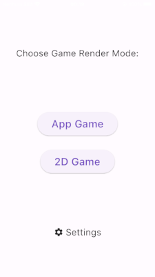

# Stack and Win Game - Flutter App vs 2D flame game

Welcome to the Stack and Win game, a simple Flutter project designed to help you explore and understand the key differences between building an App Game and a 2D Game using the Flame package.

## Overview

This project is intended to serve as a practical example for those who are interested in game development with Flutter. We aim to provide a side-by-side comparison of building a traditional app-style game and a 2D game using the powerful Flame game development framework.

### The Game

"Stack and Win" is an engaging and skill-based game that challenges your timing and precision. The objective is simple: stack squares on top of each other without losing any to earn victory.

#### Gameplay Mechanics

- **Horizontal Movement**: You are presented with a set number of squares that move horizontally across the screen. Your goal is to tap or click at the right moment to make them come to a stop.

- **Stacking Strategy**: As soon as you successfully halt the squares, an identical set of squares appears in the row above. Your task is to stack them directly on top of the squares from the previous row, aligning them perfectly.

- **Avoiding Loss**: The key challenge is to ensure that the new squares stack precisely on the previous row. If you miss this alignment, the bottom row of squares will disappear, and you'll lose them.

### App Game

The app game utilizes a `GridView.count` widget to create a grid with a dynamic number of rows and columns based on user-configured settings. Each cell's rendering is conditionally determined by evaluating a boolean array, which controls whether a cell is filled or not.

#### Game Logic

The game's logic is orchestrated by a timer that operates at a user-defined speed (level). When the timer triggers, the game's internal state is updated, and the `setState` method is employed to refresh the grid. This dynamic interaction between the timer and `setState` ensures that the grid is consistently updated to reflect the game's progress.

Key Features:
- **Dynamic Grid:** The grid's dimensions are responsive to user settings, allowing for a customized gaming experience.
- **Boolean Array Control:** The boolean array plays a crucial role in rendering individual grid cells, providing flexibility for game dynamics.
- **Real-time Updates:** Utilizing the `setState` method and timer, the grid is kept up to date with the game's logic, ensuring real-time feedback to players.

### 2D Game

The 2D game leverages the powerful Flame package for rendering, offering a versatile and high-performance approach to creating a dynamic gaming experience.

#### Key Components

1. **Custom BackgroundGrid2D Component**: The game features a specialized `BackgroundGrid2D` component responsible for rendering backgrounds and grid lines. This component enhances the visual aesthetics of the game while maintaining optimal performance.

2. **Custom FilledSquare2D Component**: The heart of the game's rendering, the `FilledSquare2D` component, is custom-designed to allow precise control over square positions and the number of squares to render side by side.

#### Dynamic Speed Calculation

In this rendering mode, game speed is calculated dynamically by accumulating the time between the last frame update.

#### Unique Logic

Differing from the app game, the 2D game employs a distinct logic for rendering. Instead of relying on a boolean array to track grid item states, it manages array indexes to precisely control the display of filled square components. This method grants you the flexibility to specify the exact index at which the filled square component should be showcased, allowing for intricate and customizable game visuals.

While the Flame package offers extensive capabilities, this 2D game rendering mode keeps things simple, making it an ideal starting point for those looking to explore game development concepts without overwhelming complexity.

## What You'll Learn

1. **Flutter Game Development**: You will get hands-on experience with game development in Flutter, one of the most versatile and popular cross-platform frameworks available.

2. **Flame Package**: Explore the capabilities of the Flame package, a game engine for Flutter, designed to simplify game development.

3. **2D Game Development**: Understand the fundamentals of 2D game development, including concepts like rendering, updating game state, and handling user interactions.

4. **App Game vs. 2D Game**: Compare and contrast the code and architecture between a typical app-style game and a 2D game. Learn how to structure your game project based on your specific requirements.

5. **Knowledge Sharing**: This project encourages knowledge sharing and open collaboration among developers interested in game development. Share your experiences and insights with the community.

## Getting Started

1. Clone or download this repository to your local machine.
2. Open the project in your preferred code editor.
3. Explore the source code for both the app-style game and the 2D game to see the differences and similarities.
4. Experiment with the code, make changes, and see how they affect the gameplay and functionality.
5. Share your thoughts and experiences with the Flutter and game development communities.

## Contribute

We welcome contributions and feedback from the community. If you have suggestions, improvements, or additional insights, please feel free to open an issue or create a pull request.

## Resources

- [Flutter Documentation](https://flutter.dev/docs)
- [Flame Package Documentation](https://pub.dev/packages/flame)
- [Flutter Community](https://flutter.dev/community)
